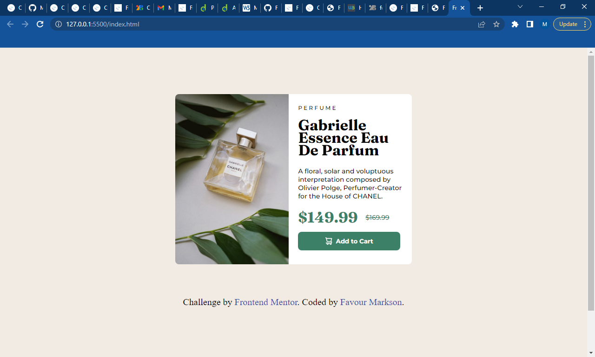
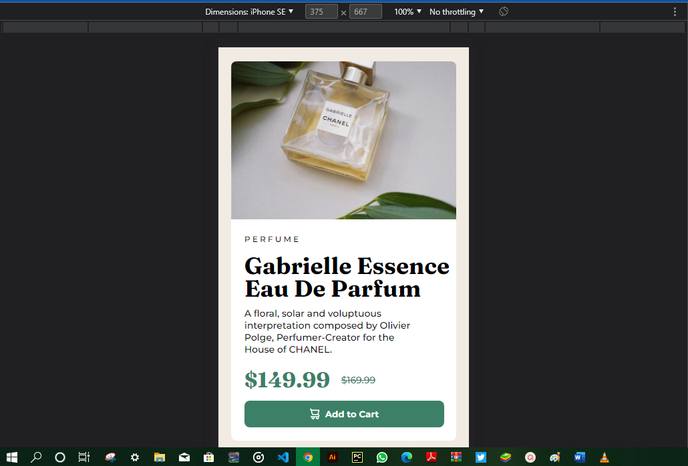

# Frontend Mentor - Product preview card component solution

This is a solution to the [Product preview card component challenge on Frontend Mentor](https://www.frontendmentor.io/challenges/product-preview-card-component-GO7UmttRfa). Frontend Mentor challenges help you improve your coding skills by building realistic projects. 

## Table of contents

- [Overview](#overview)
  - [The challenge](#the-challenge)
  - [Screenshot](#screenshot)
  - [Links](#links)
- [My process](#my-process)
  - [Built with](#built-with)
  - [What I learned](#what-i-learned)
  - [Continued development](#continued-development)
- [Author](#author)
- [Acknowledgments](#acknowledgments)

## Overview

### The challenge

Users should be able to:

- View the optimal layout depending on their device's screen size
- See hover and focus states for interactive elements

### Screenshot

### Links

- Solution URL: (https://github.com/Markson17/Product-preview-card)
- Live Site URL: 
(https://markson17.github.io/Product-preview-card/)

## My process

### Built with

- Semantic HTML5 markup
- CSS custom properties
- Flexbox
- CSS Grid
- [Google fonts](https://fonts.google.com/) - For styles

### What I learned

I learnt how to make use of the css flexbox and grid effectively and how to make the website responsive

To see how you can add code snippets, see below:

### Continued development

I want to focus more on the implementation of the css flexbox and grid maximally. 

## Author

- Website - [Favour Markson](https://favour-markson-resume.herokuapp.com/)
- Frontend Mentor - [@Markson17](https://www.frontendmentor.io/profile/Markson17)
- Twitter - [@MarksonFavour1](https://www.twitter.com/MarksonFavour1)

## Acknowledgments

I would like to thank the frontendmentor Team for developing this app that has many projects based on any level.

